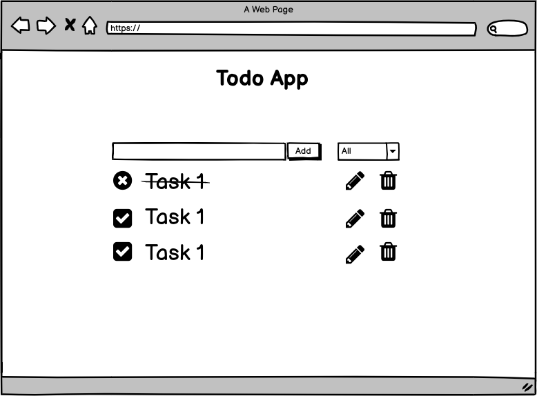

# Javascript Todo App

Simple Todo list app using JavaScript. Users can add tasks, mark tasks as completed and delete them.

## Getting Started

### Prerequisites

 - Browser e.g Chrome, Mozilla 
 - [Git](https://git-scm.com/)

### How to install

1. Clone the repository
```
git clone https://github.com/javorkabotond/js-todo-app.git
```
2. Click index.html and the app automatically opens in the default browser

## User interface

The user interface comprises of:

- a list to show tasks either to be done, marked as completed or deleted
- a form with a text input and a button to allow the user to add new tasks

## Mockup



## Scenarios

### Empty list of tasks

As a user, when I first open the app I see an empty list of tasks and a form to add a new task with text input and an Add button.

### Adding a new task

As a user, when I type into the text input and click Add, a new task will be created and shown in the list of tasks as well as the text input will be cleared so that I can add the next task.

### Marking a task as completed

As a user, when I complete a task then I click on the checkbox and the text formatting changes to strikethrough to indicate that the task has been completed.

### Marking a task as not completed

As a user, when I not complete a task then I click on the checkbox and the text formatting changes to basic style to indicate that the task has been completed. 

### Deleting a task

As a user, when I click the trash icon of a task, then the task is deleted from the list.

### Renaming a task

As a user, when I click on the pen icon of a task, then a text input appears with the text and save button so that when I change the text and click save button, the task will be updated in the list of tasks.

### Filtering tasks by completion

As a user, when I click drop-down list and I choose whether I want to see all task, completed tasks or not completed tasks.

## Methods

### Add a new task

The first thing, I set up an array where I will push todo items. Each todo item will be an object with the following properties:

- `id` (number): a unique identifier for the item
- `text` (string): which holds whatever user types into the text input
- `completed` (bool): which helps me know if a task has been marked completed or not

### Render tasks

Once a new todo item is added to the array, we want the app to be updated with the item rendered on the screen

### Mark a task as completed

The user can mark a task completed. We need to listen for the click event on the checkbox and toggle the checked property on the corresponding todo item. 

### Delete task

The user can delete a task. We will listen for the click event on the delete icon then grab the key of the parent and pass it off to the `deleteTask()` function which will remove the corresponding todo object in todoItems array send the todo item to `renderTodo()` to be removed from the dom.

### Rename task

The user can rename a task. We will listen for the clic event on the edit icon and appear text input with the text and save button. Then we can change text for task. After we click save button then grab the key of the parent and pass it off to the `editTask()` function which will update the orresponding todo object in todoItems array send the todo item to `renderTodo()` to be removed from the dom.

### Filter tasks by completion

We will click the select button what contain three options: 

- `All`: We will see all task.
- `Completed`: We will see completed task
- `Not completed`: We will see not completed task

When user will choose option then call `renderTodo()` what refresh dom.

## Running tests

`yarn test`

## Technologies used

- [Javascript](https://developer.mozilla.org/en-US/docs/Web/JavaScript)
- [CRA](https://github.com/facebook/create-react-app)
- [Jest](https://jestjs.io/)

## Author
 - Botond Javorka

